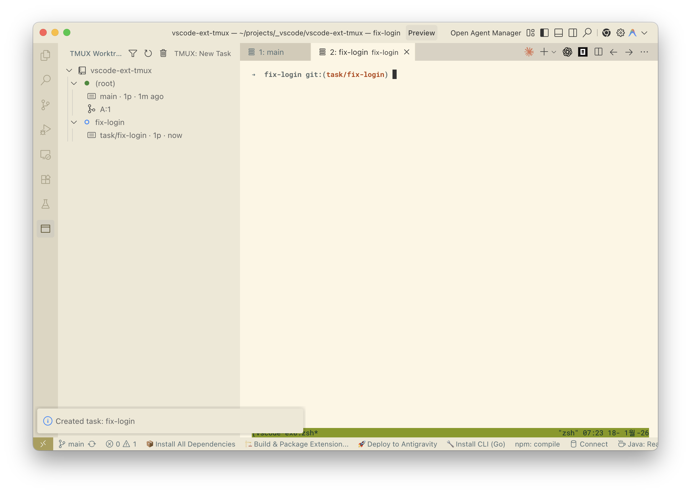

# TMUX Worktree

**Manage tmux sessions with git worktrees directly from VS Code.**



This project provides a seamless workflow for developers using `git worktree` and `tmux`. It allows you to switch between worktrees and their corresponding tmux sessions easily.

## ✨ Features

- **Explorer View**: Visualize all your git worktrees and tmux sessions in a tree view.
- **Auto-Attach**: Automatically attach to the correct tmux session when opening a worktree.
- **Session Management**: Create, attach, and manage tmux sessions.
- **Worktree Integration**: Create new worktrees and associated sessions in one go.
- **CLI Tool**: Includes a TUI (`tmux-worktree-tui`) for managing sessions from the terminal.

## 💡 Use Case

**Persistent AI Coding Sessions**

Run AI coding agents (like `opencode`, `claudecode`, `gemini-cli`) inside tmux sessions. This ensures your working context and agent history are never lost, even if your SSH connection drops or you close VS Code.

- **Always On**: AI agents keep running in the background.
- **Anywhere Access**: Seamlessly resume your coding session from any device (e.g., using **Termux** on Android) without losing state.

## 🛠 Tech Stack

- **Extension**: TypeScript, VS Code Extension API.
- **CLI**: Go, Bubble Tea (TUI Framework).

## 🚀 Getting Started

### Prerequisites
- **tmux**: Must be installed.
- **git**: Must be installed.
- **VS Code**: Version 1.85.0 or higher.

### Setup
1.  Clone the repository.
2.  Install dependencies:
    ```bash
    npm install
    cd cli && go mod download
    ```

### Development
- **Run Extension**: Press `F5` in VS Code.
- **Build Extension**: `npm run compile`.
- **Lint**: `npm run lint`.
- **Run CLI**: `cd cli && go run ./main.go`.

## 🤝 Contributing

1.  Clone the repository.
2.  Create a feature branch.
3.  Make your changes.
4.  Run lint and build tests.
5.  Submit a Pull Request.

## 🤖 AI Agent Setup

For AI-assisted development, see [README.ai-ready.md](README.ai-ready.md).
